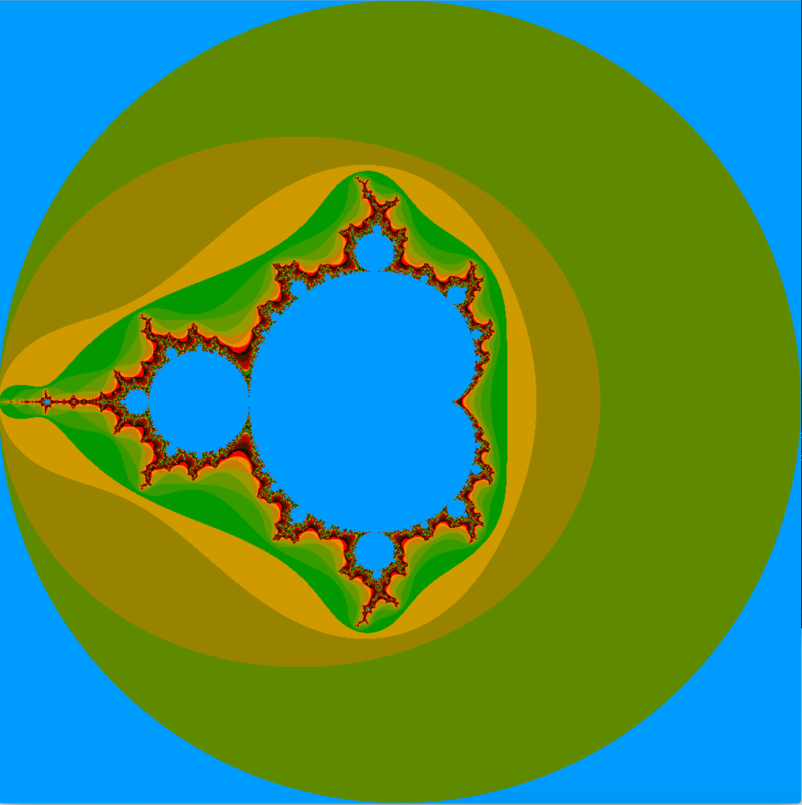
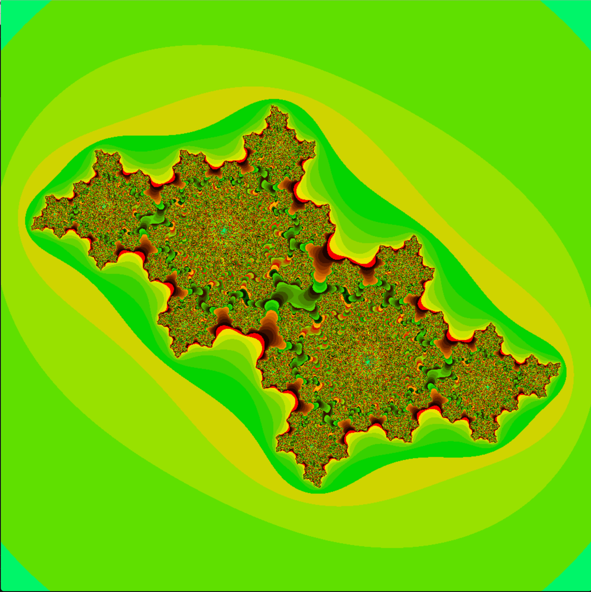
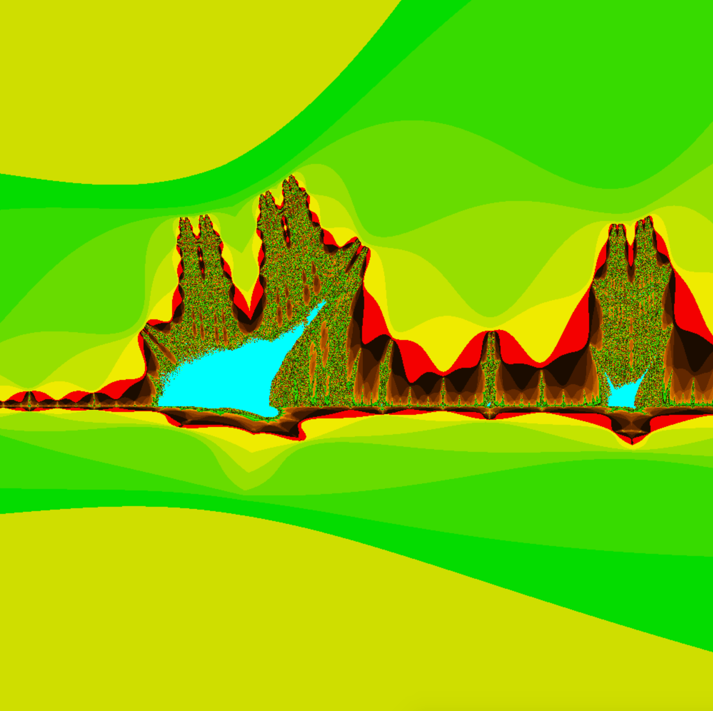
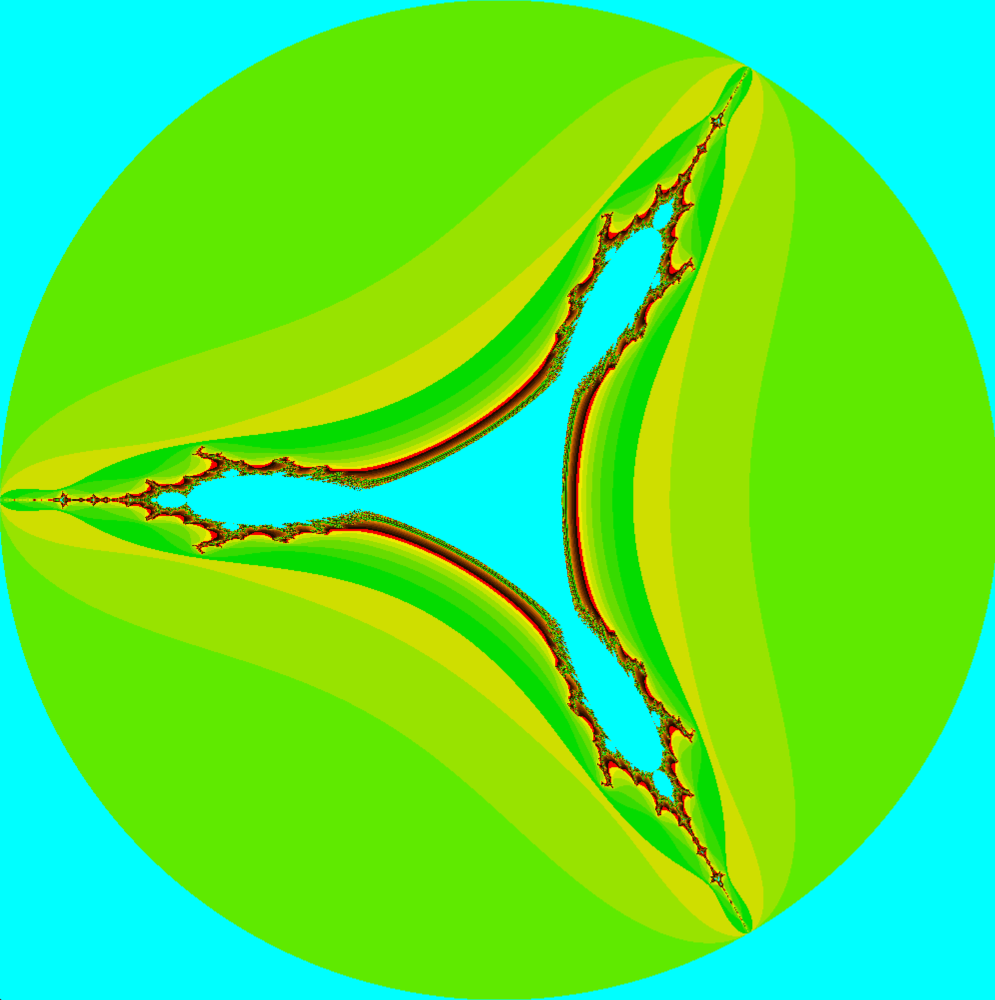

# FRACTOL

This is a 42 cursus project that uses the minilibx graphics library to create beautiful fractal images.

## Mandelbrot Set


The Mandelbrot set is a famous fractal in mathematics. It is defined by a simple iterative algorithm and produces intricate and visually stunning patterns. The set is named after its discoverer, Benoît B. Mandelbrot, and is characterized by its self-similarity at various scales.

## Julia Set


The Julia set is another well-known fractal that is closely related to the Mandelbrot set. It is generated by a similar iterative process but with a fixed complex number known as the Julia constant. The Julia set can exhibit a wide range of shapes and patterns, depending on the chosen constant.

## Burning Ship Set


The Burning Ship set, also known as the Burning Ship fractal, is a variant of the Mandelbrot set. It is characterized by its distinctive ship-like shapes and intricate details. The fractal is named for its resemblance to a burning ship on the water.

## Tricorn Set


The Tricorn set, also called the Mandelbar set, is another variation of the Mandelbrot set. It is known for its symmetric and ornate structures, often resembling tricorn hats. Like the other fractals, it is generated through iterative calculations and exhibits fascinating self-similarities.

Feel free to explore these fractals and enjoy the mesmerizing patterns they create!

## Building the Program

To build the program and display two different fractals, use the following command:
```shell
make all
make bonus
